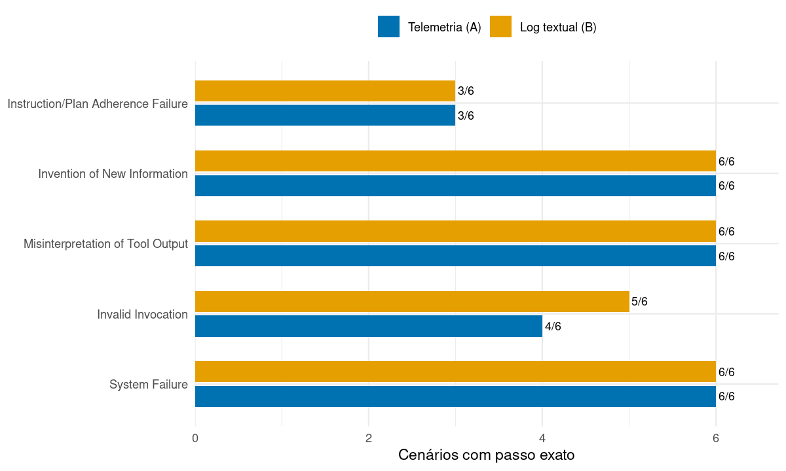
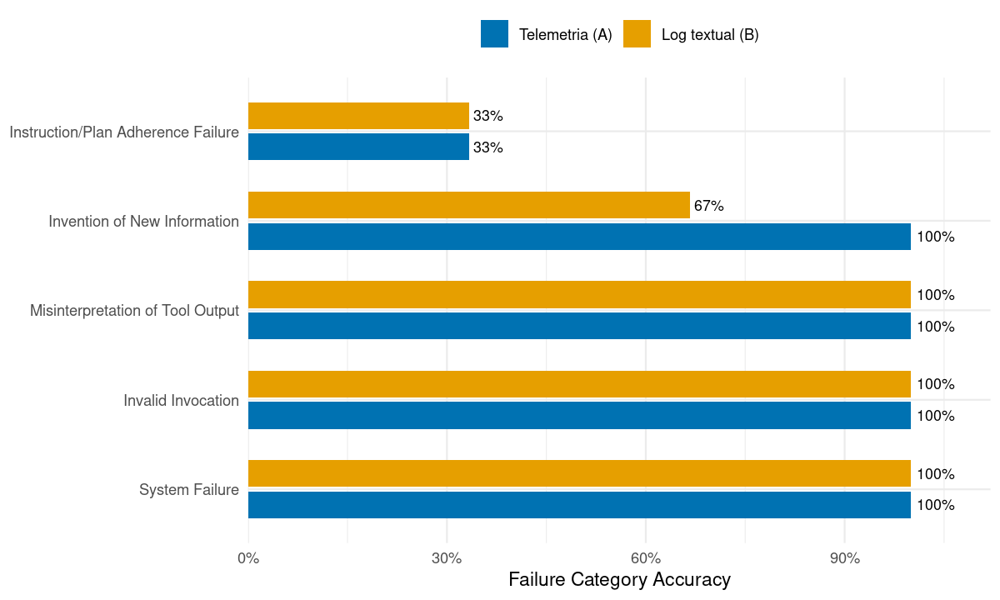
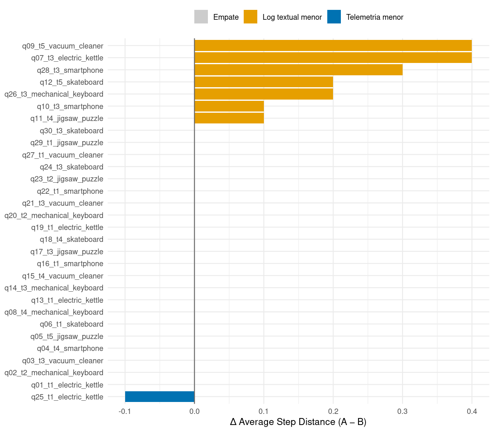

MAS-SIM — Telemetria (A) vs Log textual (B)
================

  - [Resumo descritivo](#resumo-descritivo)
      - [Acurácias](#acurácias)
      - [Distância de passo](#distância-de-passo)
  - [Localização da etapa crítica](#localização-da-etapa-crítica)
      - [Resultados por categoria](#resultados-por-categoria)
  - [Classificação da causa raiz](#classificação-da-causa-raiz)
      - [Acurácia de categoria por
        cenário](#acurácia-de-categoria-por-cenário)
  - [Comparação pareada](#comparação-pareada)
      - [Distância por cenário](#distância-por-cenário)
      - [Testes inferenciais](#testes-inferenciais)
  - [Placar por cenário](#placar-por-cenário)

**MAS:** Gemma3-27B-RUN-3 | **Juiz:** judge-codex-gpt-5-5 |
**Cenários:** 30 | **Repetições por cenário:** 10

Este relatório é derivado de `metricas.csv` e do `runs_long.csv` do
mesmo par MAS/juiz. Todos os testes e intervalos usam o contexto C8; a
diferença de distância é Telemetria menos Log textual, portanto valor
positivo favorece B.

# Resumo descritivo

## Acurácias

| Métrica                   | Telemetria (A) | Log textual (B) | Δ (A−B) p.p. |
| :------------------------ | -------------: | --------------: | -----------: |
| Critical Step Accuracy    |          83.3% |           86.7% |        \-3.3 |
| Passo ±1                  |          96.7% |           96.7% |        \+0.0 |
| Passo ±3                  |         100.0% |          100.0% |        \+0.0 |
| Passo ±5                  |         100.0% |          100.0% |        \+0.0 |
| Failure Category Accuracy |          86.7% |           80.0% |        \+6.7 |

## Distância de passo

| Braço           | Média |    DP | Med. | Mín. | Máx. | Norm. |   MAE |
| :-------------- | ----: | ----: | ---: | ---: | ---: | ----: | ----: |
| Telemetria (A)  | 0.263 | 0.629 |    0 |    0 |    3 | 0.053 | 0.263 |
| Log textual (B) | 0.210 | 0.596 |    0 |    0 |    3 | 0.042 | 0.237 |

# Localização da etapa crítica

Acurácia de passo exato por categoria e braço. A quantidade de cenários
em cada barra é derivada da execução selecionada.

## Resultados por categoria

| Categoria                          | Braço           | Failure Category Accuracy | Critical Step Accuracy | Average Step Distance |
| :--------------------------------- | :-------------- | ------------------------: | ---------------------: | --------------------: |
| System Failure                     | Telemetria (A)  |                    100.0% |                    6/6 |                 0.000 |
| System Failure                     | Log textual (B) |                    100.0% |                    6/6 |                 0.000 |
| Invalid Invocation                 | Telemetria (A)  |                    100.0% |                    4/6 |                 0.417 |
| Invalid Invocation                 | Log textual (B) |                    100.0% |                    5/6 |                 0.217 |
| Misinterpretation of Tool Output   | Telemetria (A)  |                    100.0% |                    6/6 |                 0.000 |
| Misinterpretation of Tool Output   | Log textual (B) |                    100.0% |                    6/6 |                 0.000 |
| Invention of New Information       | Telemetria (A)  |                    100.0% |                    6/6 |                 0.000 |
| Invention of New Information       | Log textual (B) |                     66.7% |                    6/6 |                 0.000 |
| Instruction/Plan Adherence Failure | Telemetria (A)  |                     33.3% |                    3/6 |                 0.900 |
| Instruction/Plan Adherence Failure | Log textual (B) |                     33.3% |                    3/6 |                 0.833 |

# Classificação da causa raiz

As frequências abaixo usam as predições individuais em `runs_long.csv`;
por isso podem diferir das acurácias agregadas por cenário.

| Categoria                          | Cat. A | Cat. B | Passo A | Passo B | MAE A | MAE B |
| :--------------------------------- | -----: | -----: | ------: | ------: | ----: | ----: |
| System Failure                     |   60/0 |   60/0 |    60/0 |    60/0 | 0.000 | 0.000 |
| Invalid Invocation                 |   60/0 |   60/0 |   35/25 |   47/13 | 0.417 | 0.217 |
| Misinterpretation of Tool Output   |   60/0 |   60/0 |    60/0 |    60/0 | 0.000 | 0.000 |
| Invention of New Information       |   51/9 |  47/13 |    60/0 |    60/0 | 0.000 | 0.000 |
| Instruction/Plan Adherence Failure |  23/37 |  21/39 |   30/30 |   29/31 | 0.900 | 0.967 |

## Acurácia de categoria por cenário

# Comparação pareada

## Distância por cenário

## Testes inferenciais

O intervalo da última linha é bootstrap BCa pareado, com seed 42 e 5.000
reamostragens de cenários completos.

| Teste                                               | Ambos | Só A | Só B | Nenhum | Resultado                  | Leitura                  |
| :-------------------------------------------------- | ----: | ---: | ---: | -----: | :------------------------- | :----------------------- |
| McNemar — Failure Category Accuracy                 |    23 |    3 |    1 |      3 | p = 0.617                  | sem diferença detectável |
| McNemar — Critical Step Accuracy                    |    25 |    0 |    1 |      4 | p = 1.000                  | sem diferença detectável |
| Wilcoxon pareado — Average Step Distance            |    NA |   NA |   NA |     NA | p = 0.025                  | A distinguivelmente pior |
| Bootstrap BCa IC95% — Δ Average Step Distance (A−B) |    NA |   NA |   NA |     NA | \+0.053 \[+0.020, +0.103\] | IC exclui zero → A pior  |

# Placar por cenário

| Cenário                       | GT categoria                       | GT passo |             A categoria              | A passo |             B categoria              | B passo |
| :---------------------------- | :--------------------------------- | :------: | :----------------------------------: | :-----: | :----------------------------------: | :-----: |
| q01\_t1\_electric\_kettle     | System Failure                     |    3     |           System Failure ✓           |   3 ✓   |           System Failure ✓           |   3 ✓   |
| q02\_t2\_mechanical\_keyboard | System Failure                     |    3     |           System Failure ✓           |   3 ✓   |           System Failure ✓           |   3 ✓   |
| q03\_t3\_vacuum\_cleaner      | System Failure                     |    3     |           System Failure ✓           |   3 ✓   |           System Failure ✓           |   3 ✓   |
| q04\_t4\_smartphone           | System Failure                     |    3     |           System Failure ✓           |   3 ✓   |           System Failure ✓           |   3 ✓   |
| q05\_t5\_jigsaw\_puzzle       | System Failure                     |    3     |           System Failure ✓           |   3 ✓   |           System Failure ✓           |   3 ✓   |
| q06\_t1\_skateboard           | System Failure                     |    3     |           System Failure ✓           |   3 ✓   |           System Failure ✓           |   3 ✓   |
| q07\_t3\_electric\_kettle     | Invalid Invocation                 |    2     |         Invalid Invocation ✓         |   3 ✗   |         Invalid Invocation ✓         |   2 ✓   |
| q08\_t4\_mechanical\_keyboard | Invalid Invocation                 |    2     |         Invalid Invocation ✓         |   2 ✓   |         Invalid Invocation ✓         |   2 ✓   |
| q09\_t5\_vacuum\_cleaner      | Invalid Invocation                 |    2     |         Invalid Invocation ✓         |   2 ✓   |         Invalid Invocation ✓         |   2 ✓   |
| q10\_t3\_smartphone           | Invalid Invocation                 |    2     |         Invalid Invocation ✓         |   3 ✗   |         Invalid Invocation ✓         |   3 ✗   |
| q11\_t4\_jigsaw\_puzzle       | Invalid Invocation                 |    2     |         Invalid Invocation ✓         |   2 ✓   |         Invalid Invocation ✓         |   2 ✓   |
| q12\_t5\_skateboard           | Invalid Invocation                 |    2     |         Invalid Invocation ✓         |   2 ✓   |         Invalid Invocation ✓         |   2 ✓   |
| q13\_t1\_electric\_kettle     | Misinterpretation of Tool Output   |    4     |  Misinterpretation of Tool Output ✓  |   4 ✓   |  Misinterpretation of Tool Output ✓  |   4 ✓   |
| q14\_t3\_mechanical\_keyboard | Misinterpretation of Tool Output   |    4     |  Misinterpretation of Tool Output ✓  |   4 ✓   |  Misinterpretation of Tool Output ✓  |   4 ✓   |
| q15\_t4\_vacuum\_cleaner      | Misinterpretation of Tool Output   |    4     |  Misinterpretation of Tool Output ✓  |   4 ✓   |  Misinterpretation of Tool Output ✓  |   4 ✓   |
| q16\_t1\_smartphone           | Misinterpretation of Tool Output   |    4     |  Misinterpretation of Tool Output ✓  |   4 ✓   |  Misinterpretation of Tool Output ✓  |   4 ✓   |
| q17\_t3\_jigsaw\_puzzle       | Misinterpretation of Tool Output   |    4     |  Misinterpretation of Tool Output ✓  |   4 ✓   |  Misinterpretation of Tool Output ✓  |   4 ✓   |
| q18\_t4\_skateboard           | Misinterpretation of Tool Output   |    4     |  Misinterpretation of Tool Output ✓  |   4 ✓   |  Misinterpretation of Tool Output ✓  |   4 ✓   |
| q19\_t1\_electric\_kettle     | Invention of New Information       |    4     |    Invention of New Information ✓    |   4 ✓   |    Invention of New Information ✓    |   4 ✓   |
| q20\_t2\_mechanical\_keyboard | Invention of New Information       |    4     |    Invention of New Information ✓    |   4 ✓   |    Invention of New Information ✓    |   4 ✓   |
| q21\_t3\_vacuum\_cleaner      | Invention of New Information       |    4     |    Invention of New Information ✓    |   4 ✓   |  Misinterpretation of Tool Output ✗  |   4 ✓   |
| q22\_t1\_smartphone           | Invention of New Information       |    4     |    Invention of New Information ✓    |   4 ✓   |    Invention of New Information ✓    |   4 ✓   |
| q23\_t2\_jigsaw\_puzzle       | Invention of New Information       |    4     |    Invention of New Information ✓    |   4 ✓   |  Misinterpretation of Tool Output ✗  |   4 ✓   |
| q24\_t3\_skateboard           | Invention of New Information       |    4     |    Invention of New Information ✓    |   4 ✓   |    Invention of New Information ✓    |   4 ✓   |
| q25\_t1\_electric\_kettle     | Instruction/Plan Adherence Failure |    1     | Instruction/Plan Adherence Failure ✓ |   1 ✓   |      Intent-Plan Misalignment ✗      |   1 ✓   |
| q26\_t3\_mechanical\_keyboard | Instruction/Plan Adherence Failure |    1     |            Inconclusive ✗            |   0 ✗   |            Inconclusive ✗            |   0 ✗   |
| q27\_t1\_vacuum\_cleaner      | Instruction/Plan Adherence Failure |    1     |      Intent-Plan Misalignment ✗      |   1 ✓   | Instruction/Plan Adherence Failure ✓ |   1 ✓   |
| q28\_t3\_smartphone           | Instruction/Plan Adherence Failure |    1     |            Inconclusive ✗            |   0 ✗   |            Inconclusive ✗            |   0 ✗   |
| q29\_t1\_jigsaw\_puzzle       | Instruction/Plan Adherence Failure |    1     | Instruction/Plan Adherence Failure ✓ |   1 ✓   | Instruction/Plan Adherence Failure ✓ |   1 ✓   |
| q30\_t3\_skateboard           | Instruction/Plan Adherence Failure |    1     |  Misinterpretation of Tool Output ✗  |   4 ✗   |  Misinterpretation of Tool Output ✗  |   4 ✗   |
