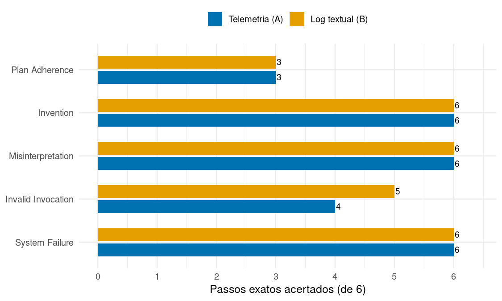
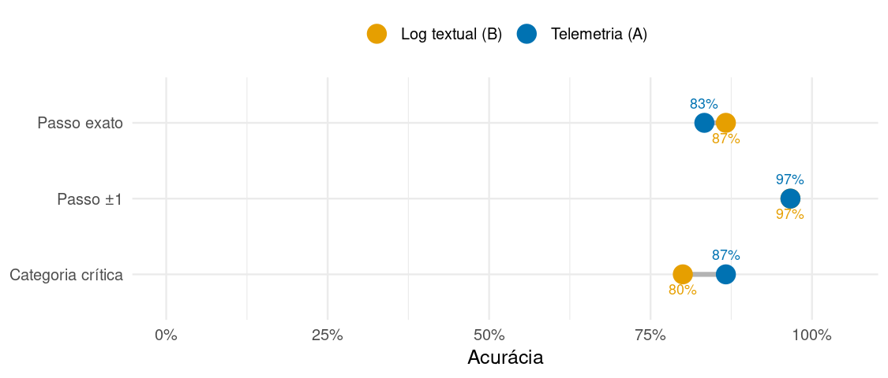
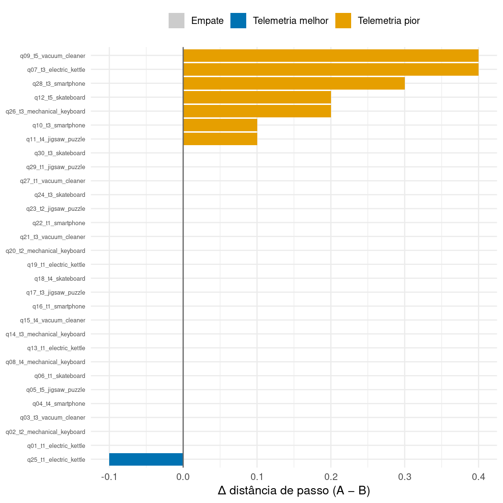
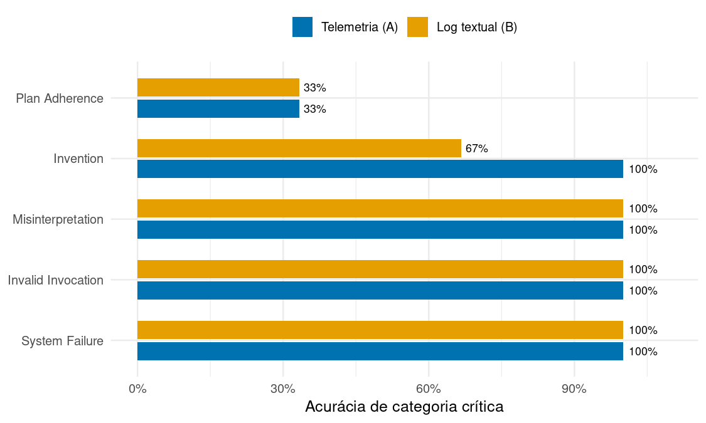

Telemetria (A) vs Log textual (B) — análise das RQs
================
10/07/2026

  - [1. Sumário estatístico
    descritivo](#1-sumário-estatístico-descritivo)
      - [1.1 Acurácias (proporção de acerto, dos 30
        cenários)](#11-acurácias-proporção-de-acerto-dos-30-cenários)
      - [1.2 Distância de passo — descritivo completo (menor é
        melhor)](#12-distância-de-passo--descritivo-completo-menor-é-melhor)
  - [2. Passos acertados por
    abordagem](#2-passos-acertados-por-abordagem)
  - [3. Comparação A × B](#3-comparação-a--b)
      - [3.1 Métricas-chave (dumbbell: distância entre os pontos =
        vantagem de um
        braço)](#31-métricas-chave-dumbbell-distância-entre-os-pontos--vantagem-de-um-braço)
      - [3.2 Distância pareada por cenário (\>0 = telemetria pior
        naquele
        cenário)](#32-distância-pareada-por-cenário-0--telemetria-pior-naquele-cenário)
      - [3.3 Categoria por tipo de falha (H1/H2: semânticas vs
        superfície)](#33-categoria-por-tipo-de-falha-h1h2-semânticas-vs-superfície)
      - [3.4 MAE e frequência por categoria nas repetições do
        juiz](#34-mae-e-frequência-por-categoria-nas-repetições-do-juiz)
      - [3.5 Estimativas por cenário (o placar completo: A vs B vs
        gabarito)](#35-estimativas-por-cenário-o-placar-completo-a-vs-b-vs-gabarito)
  - [4. Sumário estatístico
    inferencial](#4-sumário-estatístico-inferencial)
  - [5. Conclusão](#5-conclusão)

**MAS:** Gemma3-27B-RUN-3 | **Juiz:** judge-codex-gpt-5-5 | **n = 30
cenários** (pareados por cenário, 2 braços; métricas já agregadas sobre
10 repetições pelo coletor).

Pergunta: *a telemetria (A) ajuda o juiz a **localizar** (passo) e
**classificar** (categoria) a falha, vs a baseline do artigo (B)?*
Resultado nulo é achado válido (PRD-00 §2).

-----

# 1\. Sumário estatístico descritivo

## 1.1 Acurácias (proporção de acerto, dos 30 cenários)

| Métrica           | Telemetria (A) | Log textual (B) | Δ (A−B) p.p. |
| :---------------- | -------------: | --------------: | -----------: |
| Passo exato (±0)  |          83.3% |           86.7% |        \-3.3 |
| Passo ±1          |          96.7% |           96.7% |        \+0.0 |
| Passo ±3          |         100.0% |          100.0% |        \+0.0 |
| Passo ±5          |         100.0% |          100.0% |        \+0.0 |
| Categoria crítica |          86.7% |           80.0% |        \+6.7 |
| Categoria (any)   |          86.7% |           80.0% |        \+6.7 |

*As tolerâncias ±k contam acerto quando |passo predito − gabarito| ≤ k.
Como as trajetórias têm 5 passos, ±3/±5 saturam em 100% (efeito-teto):
quem discrimina é o exato.*

## 1.2 Distância de passo — descritivo completo (menor é melhor)

| Braço           | Média |    DP | Mediana | Mín | Máx | Norm. média | MAE passo |
| :-------------- | ----: | ----: | ------: | --: | --: | ----------: | --------: |
| Telemetria (A)  | 0.263 | 0.629 |       0 |   0 |   3 |       0.053 |     0.263 |
| Log textual (B) | 0.210 | 0.596 |       0 |   0 |   3 |       0.042 |     0.237 |

-----

# 2\. Passos acertados por abordagem

Quantos cenários cada braço **localizou no passo exato**, por tipo de
falha (6 por tipo).

| Braço           | Acertos exatos | de |  Taxa |
| :-------------- | -------------: | -: | ----: |
| Telemetria (A)  |             25 | 30 | 83.3% |
| Log textual (B) |             26 | 30 | 86.7% |

-----

# 3\. Comparação A × B

## 3.1 Métricas-chave (dumbbell: distância entre os pontos = vantagem de um braço)

## 3.2 Distância pareada por cenário (\>0 = telemetria pior naquele cenário)

## 3.3 Categoria por tipo de falha (H1/H2: semânticas vs superfície)

| Categoria          | Braço           | Cat. crítica | Passo exato (de 6) | Dist. média |
| :----------------- | :-------------- | -----------: | -----------------: | ----------: |
| System Failure     | Telemetria (A)  |       100.0% |                  6 |       0.000 |
| System Failure     | Log textual (B) |       100.0% |                  6 |       0.000 |
| Invalid Invocation | Telemetria (A)  |       100.0% |                  4 |       0.417 |
| Invalid Invocation | Log textual (B) |       100.0% |                  5 |       0.217 |
| Misinterpretation  | Telemetria (A)  |       100.0% |                  6 |       0.000 |
| Misinterpretation  | Log textual (B) |       100.0% |                  6 |       0.000 |
| Invention          | Telemetria (A)  |       100.0% |                  6 |       0.000 |
| Invention          | Log textual (B) |        66.7% |                  6 |       0.000 |
| Plan Adherence     | Telemetria (A)  |        33.3% |                  3 |       0.900 |
| Plan Adherence     | Log textual (B) |        33.3% |                  3 |       0.833 |

## 3.4 MAE e frequência por categoria nas repetições do juiz

A tabela abaixo usa as repetições individuais do juiz (`runs_long.csv`).
Em cada categoria, cada braço possui 60 julgamentos (6 cenários × 10
repetições). `Cat. ac/err` e `Passo ac/err` mostram, respectivamente,
acertos e erros de categoria e de passo exato nas repetições. `MAE
passo` é a média de `|passo predito − passo do gabarito|` nessas
repetições; menor é melhor. As colunas `melhor/pior` indicam o braço
com melhor resultado naquela comparação e, após a barra, o braço com
pior resultado.

| Categoria          | Cat. ac/err A | Cat. ac/err B | Categoria melhor/pior | Passo ac/err A | Passo ac/err B | Passo melhor/pior    | MAE passo A | MAE passo B | MAE melhor/pior      |
| :----------------- | ------------: | ------------: | :-------------------- | -------------: | -------------: | :------------------- | ----------: | ----------: | :------------------- |
| System Failure     |          60/0 |          60/0 | Empate                |           60/0 |           60/0 | Empate               |       0.000 |       0.000 | Empate               |
| Invalid Invocation |          60/0 |          60/0 | Empate                |          35/25 |          47/13 | AgentRx / Telemetria |       0.417 |       0.217 | AgentRx / Telemetria |
| Misinterpretation  |          60/0 |          60/0 | Empate                |           60/0 |           60/0 | Empate               |       0.000 |       0.000 | Empate               |
| Invention          |          51/9 |         47/13 | Telemetria / AgentRx  |           60/0 |           60/0 | Empate               |       0.000 |       0.000 | Empate               |
| Plan Adherence     |         23/37 |         21/39 | Telemetria / AgentRx  |          30/30 |          29/31 | Telemetria / AgentRx |       0.900 |       0.967 | Telemetria / AgentRx |

## 3.5 Estimativas por cenário (o placar completo: A vs B vs gabarito)

Categoria e passo preditos por cada braço; `✓`/`✗` = acertou/errou vs o
gabarito.

| Cenário                       | GT categoria       | GT passo |        A categoria         | A passo |        B categoria         | B passo |
| :---------------------------- | :----------------- | :------: | :------------------------: | :-----: | :------------------------: | :-----: |
| q01\_t1\_electric\_kettle     | System Failure     |    3     |      System Failure ✓      |   3 ✓   |      System Failure ✓      |   3 ✓   |
| q02\_t2\_mechanical\_keyboard | System Failure     |    3     |      System Failure ✓      |   3 ✓   |      System Failure ✓      |   3 ✓   |
| q03\_t3\_vacuum\_cleaner      | System Failure     |    3     |      System Failure ✓      |   3 ✓   |      System Failure ✓      |   3 ✓   |
| q04\_t4\_smartphone           | System Failure     |    3     |      System Failure ✓      |   3 ✓   |      System Failure ✓      |   3 ✓   |
| q05\_t5\_jigsaw\_puzzle       | System Failure     |    3     |      System Failure ✓      |   3 ✓   |      System Failure ✓      |   3 ✓   |
| q06\_t1\_skateboard           | System Failure     |    3     |      System Failure ✓      |   3 ✓   |      System Failure ✓      |   3 ✓   |
| q07\_t3\_electric\_kettle     | Invalid Invocation |    2     |    Invalid Invocation ✓    |   3 ✗   |    Invalid Invocation ✓    |   2 ✓   |
| q08\_t4\_mechanical\_keyboard | Invalid Invocation |    2     |    Invalid Invocation ✓    |   2 ✓   |    Invalid Invocation ✓    |   2 ✓   |
| q09\_t5\_vacuum\_cleaner      | Invalid Invocation |    2     |    Invalid Invocation ✓    |   2 ✓   |    Invalid Invocation ✓    |   2 ✓   |
| q10\_t3\_smartphone           | Invalid Invocation |    2     |    Invalid Invocation ✓    |   3 ✗   |    Invalid Invocation ✓    |   3 ✗   |
| q11\_t4\_jigsaw\_puzzle       | Invalid Invocation |    2     |    Invalid Invocation ✓    |   2 ✓   |    Invalid Invocation ✓    |   2 ✓   |
| q12\_t5\_skateboard           | Invalid Invocation |    2     |    Invalid Invocation ✓    |   2 ✓   |    Invalid Invocation ✓    |   2 ✓   |
| q13\_t1\_electric\_kettle     | Misinterpretation  |    4     |    Misinterpretation ✓     |   4 ✓   |    Misinterpretation ✓     |   4 ✓   |
| q14\_t3\_mechanical\_keyboard | Misinterpretation  |    4     |    Misinterpretation ✓     |   4 ✓   |    Misinterpretation ✓     |   4 ✓   |
| q15\_t4\_vacuum\_cleaner      | Misinterpretation  |    4     |    Misinterpretation ✓     |   4 ✓   |    Misinterpretation ✓     |   4 ✓   |
| q16\_t1\_smartphone           | Misinterpretation  |    4     |    Misinterpretation ✓     |   4 ✓   |    Misinterpretation ✓     |   4 ✓   |
| q17\_t3\_jigsaw\_puzzle       | Misinterpretation  |    4     |    Misinterpretation ✓     |   4 ✓   |    Misinterpretation ✓     |   4 ✓   |
| q18\_t4\_skateboard           | Misinterpretation  |    4     |    Misinterpretation ✓     |   4 ✓   |    Misinterpretation ✓     |   4 ✓   |
| q19\_t1\_electric\_kettle     | Invention          |    4     |        Invention ✓         |   4 ✓   |        Invention ✓         |   4 ✓   |
| q20\_t2\_mechanical\_keyboard | Invention          |    4     |        Invention ✓         |   4 ✓   |        Invention ✓         |   4 ✓   |
| q21\_t3\_vacuum\_cleaner      | Invention          |    4     |        Invention ✓         |   4 ✓   |    Misinterpretation ✗     |   4 ✓   |
| q22\_t1\_smartphone           | Invention          |    4     |        Invention ✓         |   4 ✓   |        Invention ✓         |   4 ✓   |
| q23\_t2\_jigsaw\_puzzle       | Invention          |    4     |        Invention ✓         |   4 ✓   |    Misinterpretation ✗     |   4 ✓   |
| q24\_t3\_skateboard           | Invention          |    4     |        Invention ✓         |   4 ✓   |        Invention ✓         |   4 ✓   |
| q25\_t1\_electric\_kettle     | Plan Adherence     |    1     |      Plan Adherence ✓      |   1 ✓   | Intent-Plan Misalignment ✗ |   1 ✓   |
| q26\_t3\_mechanical\_keyboard | Plan Adherence     |    1     |       Inconclusive ✗       |   0 ✗   |       Inconclusive ✗       |   0 ✗   |
| q27\_t1\_vacuum\_cleaner      | Plan Adherence     |    1     | Intent-Plan Misalignment ✗ |   1 ✓   |      Plan Adherence ✓      |   1 ✓   |
| q28\_t3\_smartphone           | Plan Adherence     |    1     |       Inconclusive ✗       |   0 ✗   |       Inconclusive ✗       |   0 ✗   |
| q29\_t1\_jigsaw\_puzzle       | Plan Adherence     |    1     |      Plan Adherence ✓      |   1 ✓   |      Plan Adherence ✓      |   1 ✓   |
| q30\_t3\_skateboard           | Plan Adherence     |    1     |    Misinterpretation ✗     |   4 ✗   |    Misinterpretation ✗     |   4 ✗   |

-----

# 4\. Sumário estatístico inferencial

Testes **pareados** (o mesmo cenário nos dois braços), n = 30.

| Teste                                     | Resultado                  | Leitura                  |
| :---------------------------------------- | :------------------------- | :----------------------- |
| McNemar — categoria crítica               | p = 0.617                  | sem diferença detectável |
| McNemar — passo exato                     | p = 1.000                  | sem diferença detectável |
| Wilcoxon pareado — distância de passo     | p = 0.025                  | A distinguivelmente pior |
| Wilcoxon pareado — categoria critica      | p = 0.424                  | sem diferença detectável |
| Bootstrap IC95% — Δ distância média (A−B) | \+0.053 \[+0.013, +0.100\] | IC exclui zero → A pior  |

Vitórias pareadas (de 30)

| Métrica             | A vence | B vence | Empate |
| :------------------ | ------: | ------: | -----: |
| cat\_acc\_critical  |       3 |       1 |     26 |
| step\_acc\_exact    |       0 |       1 |     29 |
| avg\_step\_distance |       1 |       7 |     22 |

-----

# 5\. Conclusão

Em 30 cenários pareados, a telemetria **não superou** a baseline em
nenhuma métrica de manchete: na distância de passo venceu em **1**
cenário(s) contra **7** da baseline. A **categoria** ficou empatada
(McNemar p = 0.617); a **localização** teve efeito negativo pequeno,
distinguível de zero na distância (Δ = +0.053, IC95% \[+0.013, +0.100\];
Wilcoxon p = 0.025).

Leitura: a telemetria-como-texto, mesmo estruturada e enriquecida, **não
ajuda** este juiz — e tende a distrair de leve na localização fina.

**Ressalvas:** 1 juiz, 1 MAS, n = 30; efeito-teto em ±3; os testes são
sugestivos, não confirmatórios. Um segundo juiz sobre o mesmo corpus
daria robustez.
