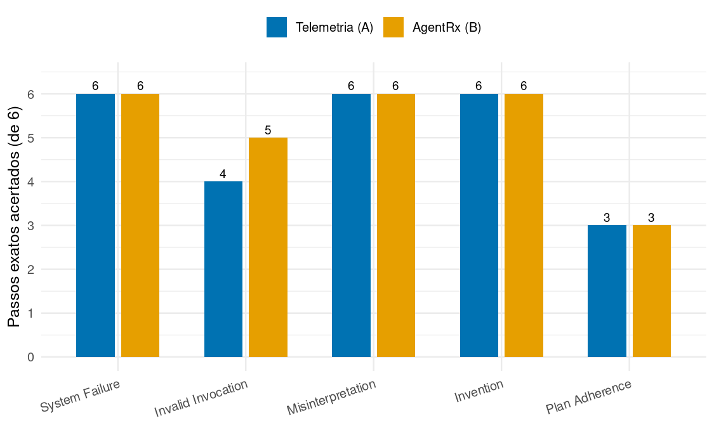
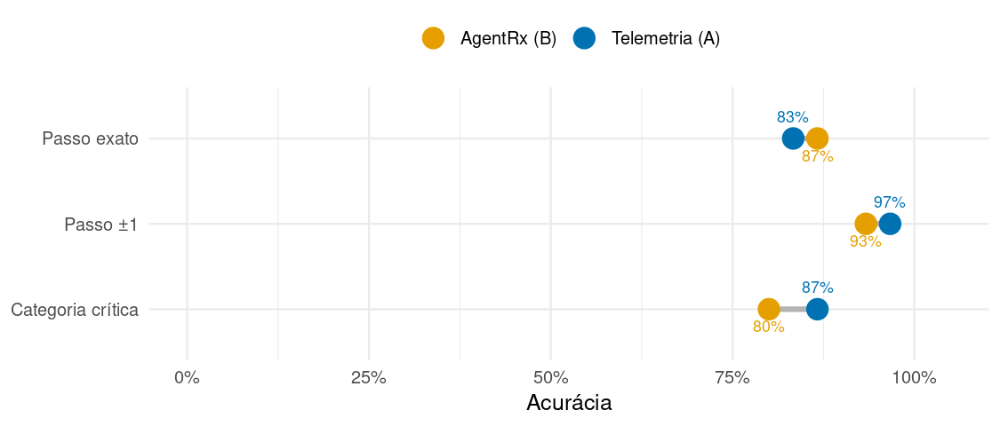
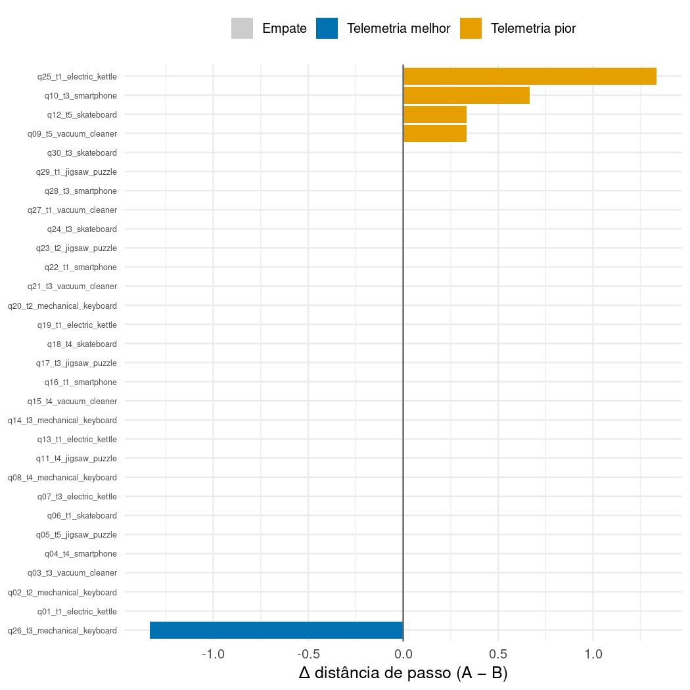
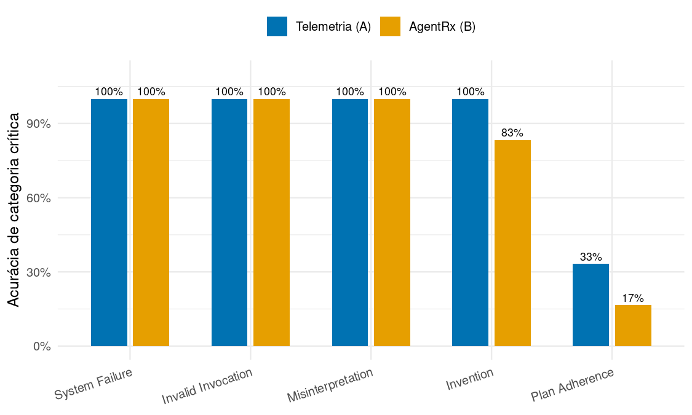

# Telemetria (A) vs AgentRx (B) — análise das RQs

06/07/2026

- [1. Sumário estatístico descritivo](#1-sum%C3%A1rio-estat%C3%ADstico-descritivo)
  - [1.1 Acurácias (proporção de acerto, das 30 cenários)](#11-acur%C3%A1cias-propor%C3%A7%C3%A3o-de-acerto-das-30-cen%C3%A1rios)
  - [1.2 Distância de passo — descritivo completo (menor é melhor)](#12-dist%C3%A2ncia-de-passo--descritivo-completo-menor-%C3%A9-melhor)
- [2. Passos acertados por abordagem](#2-passos-acertados-por-abordagem)
- [3. Comparação A × B](#3-compara%C3%A7%C3%A3o-a--b)
  - [3.1 Métricas-chave (dumbbell: distância entre os pontos = vantagem de um braço)](#31-m%C3%A9tricas-chave-dumbbell-dist%C3%A2ncia-entre-os-pontos--vantagem-de-um-bra%C3%A7o)
  - [3.2 Distância pareada por cenário (>0 = telemetria pior naquele cenário)](#32-dist%C3%A2ncia-pareada-por-cen%C3%A1rio-0--telemetria-pior-naquele-cen%C3%A1rio)
  - [3.3 Categoria por tipo de falha (H1/H2: semânticas vs superfície)](#33-categoria-por-tipo-de-falha-h1h2-sem%C3%A2nticas-vs-superf%C3%ADcie)
  - [3.4 Estimativas por cenário (o placar completo: A vs B vs gabarito)](#34-estimativas-por-cen%C3%A1rio-o-placar-completo-a-vs-b-vs-gabarito)
- [4. Sumário estatístico inferencial](#4-sum%C3%A1rio-estat%C3%ADstico-inferencial)
- [5. Conclusão](#5-conclus%C3%A3o)

**MAS:** Gemma3-27B-RUN-2 | **Juiz:** judge-codex-gpt-5-5 | **n = 30 cenários** (pareados por cenário, 2 braços;
métricas já agregadas sobre as 3 reps pelo coletor).

Pergunta: *a telemetria (A) ajuda o juiz a **localizar** (passo) e **classificar** (categoria) a falha, vs a baseline do
artigo (B)?* Resultado nulo é achado válido (PRD-00 §2).

______________________________________________________________________

# 1. Sumário estatístico descritivo

## 1.1 Acurácias (proporção de acerto, das 30 cenários)

| Métrica | Telemetria (A) | AgentRx (B) | Δ (A−B) p.p. |
| :- | -: | -: | -: |
| Passo exato (±0) | 83.3% | 86.7% | -3.3 |
| Passo ±1 | 96.7% | 93.3% | +3.3 |
| Passo ±3 | 100.0% | 100.0% | +0.0 |
| Passo ±5 | 100.0% | 100.0% | +0.0 |
| Categoria crítica | 86.7% | 80.0% | +6.7 |
| Categoria (any) | 86.7% | 80.0% | +6.7 |

*As tolerâncias ±k contam acerto quando |passo predito − gabarito| ≤ k. Como as trajetórias têm 5 passos, ±3/±5 saturam
em 100% (efeito-teto): quem discrimina é o exato.*

## 1.2 Distância de passo — descritivo completo (menor é melhor)

| Braço | Média | DP | Mediana | Mín | Máx | Norm. média | MAE passo |
| :- | -: | -: | -: | -: | -: | -: | -: |
| Telemetria (A) | 0.267 | 0.634 | 0 | 0 | 3 | 0.053 | 0.333 |
| AgentRx (B) | 0.222 | 0.657 | 0 | 0 | 3 | 0.044 | 0.222 |

______________________________________________________________________

# 2. Passos acertados por abordagem

Quantos cenários cada braço **localizou no passo exato**, por tipo de falha (6 por tipo).

| Braço | Acertos exatos | de | Taxa |
| :- | -: | -: | -: |
| Telemetria (A) | 25 | 30 | 83.3% |
| AgentRx (B) | 26 | 30 | 86.7% |

______________________________________________________________________

# 3. Comparação A × B

## 3.1 Métricas-chave (dumbbell: distância entre os pontos = vantagem de um braço)

## 3.2 Distância pareada por cenário (>0 = telemetria pior naquele cenário)

## 3.3 Categoria por tipo de falha (H1/H2: semânticas vs superfície)

| Categoria | Braço | Cat. crítica | Passo exato (de 6) | Dist. média |
| :- | :- | -: | -: | -: |
| System Failure | Telemetria (A) | 100.0% | 6 | 0.000 |
| System Failure | AgentRx (B) | 100.0% | 6 | 0.000 |
| Invalid Invocation | Telemetria (A) | 100.0% | 4 | 0.333 |
| Invalid Invocation | AgentRx (B) | 100.0% | 5 | 0.111 |
| Misinterpretation | Telemetria (A) | 100.0% | 6 | 0.000 |
| Misinterpretation | AgentRx (B) | 100.0% | 6 | 0.000 |
| Invention | Telemetria (A) | 100.0% | 6 | 0.000 |
| Invention | AgentRx (B) | 83.3% | 6 | 0.000 |
| Plan Adherence | Telemetria (A) | 33.3% | 3 | 1.000 |
| Plan Adherence | AgentRx (B) | 16.7% | 3 | 1.000 |

## 3.4 Estimativas por cenário (o placar completo: A vs B vs gabarito)

Categoria e passo preditos por cada braço; `✓`/`✗` = acertou/errou vs o gabarito.

| Cenário | GT categoria | GT passo | A categoria | A passo | B categoria | B passo |
| :- | :- | :-: | :-: | :-: | :-: | :-: |
| q01_t1_electric_kettle | System Failure | 3 | System Failure ✓ | 3 ✓ | System Failure ✓ | 3 ✓ |
| q02_t2_mechanical_keyboard | System Failure | 3 | System Failure ✓ | 3 ✓ | System Failure ✓ | 3 ✓ |
| q03_t3_vacuum_cleaner | System Failure | 3 | System Failure ✓ | 3 ✓ | System Failure ✓ | 3 ✓ |
| q04_t4_smartphone | System Failure | 3 | System Failure ✓ | 3 ✓ | System Failure ✓ | 3 ✓ |
| q05_t5_jigsaw_puzzle | System Failure | 3 | System Failure ✓ | 3 ✓ | System Failure ✓ | 3 ✓ |
| q06_t1_skateboard | System Failure | 3 | System Failure ✓ | 3 ✓ | System Failure ✓ | 3 ✓ |
| q07_t3_electric_kettle | Invalid Invocation | 2 | Invalid Invocation ✓ | 3 ✗ | Invalid Invocation ✓ | 3 ✗ |
| q08_t4_mechanical_keyboard | Invalid Invocation | 2 | Invalid Invocation ✓ | 2 ✓ | Invalid Invocation ✓ | 2 ✓ |
| q09_t5_vacuum_cleaner | Invalid Invocation | 2 | Invalid Invocation ✓ | 2 ✓ | Invalid Invocation ✓ | 2 ✓ |
| q10_t3_smartphone | Invalid Invocation | 2 | Invalid Invocation ✓ | 3 ✗ | Invalid Invocation ✓ | 2 ✓ |
| q11_t4_jigsaw_puzzle | Invalid Invocation | 2 | Invalid Invocation ✓ | 2 ✓ | Invalid Invocation ✓ | 2 ✓ |
| q12_t5_skateboard | Invalid Invocation | 2 | Invalid Invocation ✓ | 2 ✓ | Invalid Invocation ✓ | 2 ✓ |
| q13_t1_electric_kettle | Misinterpretation | 4 | Misinterpretation ✓ | 4 ✓ | Misinterpretation ✓ | 4 ✓ |
| q14_t3_mechanical_keyboard | Misinterpretation | 4 | Misinterpretation ✓ | 4 ✓ | Misinterpretation ✓ | 4 ✓ |
| q15_t4_vacuum_cleaner | Misinterpretation | 4 | Misinterpretation ✓ | 4 ✓ | Misinterpretation ✓ | 4 ✓ |
| q16_t1_smartphone | Misinterpretation | 4 | Misinterpretation ✓ | 4 ✓ | Misinterpretation ✓ | 4 ✓ |
| q17_t3_jigsaw_puzzle | Misinterpretation | 4 | Misinterpretation ✓ | 4 ✓ | Misinterpretation ✓ | 4 ✓ |
| q18_t4_skateboard | Misinterpretation | 4 | Misinterpretation ✓ | 4 ✓ | Misinterpretation ✓ | 4 ✓ |
| q19_t1_electric_kettle | Invention | 4 | Invention ✓ | 4 ✓ | Invention ✓ | 4 ✓ |
| q20_t2_mechanical_keyboard | Invention | 4 | Invention ✓ | 4 ✓ | Invention ✓ | 4 ✓ |
| q21_t3_vacuum_cleaner | Invention | 4 | Invention ✓ | 4 ✓ | Misinterpretation ✗ | 4 ✓ |
| q22_t1_smartphone | Invention | 4 | Invention ✓ | 4 ✓ | Invention ✓ | 4 ✓ |
| q23_t2_jigsaw_puzzle | Invention | 4 | Invention ✓ | 4 ✓ | Invention ✓ | 4 ✓ |
| q24_t3_skateboard | Invention | 4 | Invention ✓ | 4 ✓ | Invention ✓ | 4 ✓ |
| q25_t1_electric_kettle | Plan Adherence | 1 | Plan Adherence ✓ | 2 ✗ | Intent-Plan Misalignment ✗ | 1 ✓ |
| q26_t3_mechanical_keyboard | Plan Adherence | 1 | Inconclusive ✗ | 1 ✓ | Inconclusive ✗ | -1 ✗ |
| q27_t1_vacuum_cleaner | Plan Adherence | 1 | Intent-Plan Misalignment ✗ | 1 ✓ | Intent-Plan Misalignment ✗ | 1 ✓ |
| q28_t3_smartphone | Plan Adherence | 1 | Inconclusive ✗ | 0 ✗ | Inconclusive ✗ | 0 ✗ |
| q29_t1_jigsaw_puzzle | Plan Adherence | 1 | Plan Adherence ✓ | 1 ✓ | Plan Adherence ✓ | 1 ✓ |
| q30_t3_skateboard | Plan Adherence | 1 | Misinterpretation ✗ | 4 ✗ | Misinterpretation ✗ | 4 ✗ |

______________________________________________________________________

# 4. Sumário estatístico inferencial

Testes **pareados** (o mesmo cenário nos dois braços), n = 30.

| Teste | Resultado | Leitura |
| :- | :- | :- |
| McNemar — categoria crítica | p = 0.480 | sem diferença detectável |
| McNemar — passo exato | p = 1.000 | sem diferença detectável |
| Wilcoxon pareado — distância de passo | p = 0.588 | sem diferença detectável |
| Bootstrap IC95% — Δ distância média (A−B) | +0.044 [-0.100, +0.178] | IC inclui zero |

Vitórias pareadas (de 30)

| Métrica | A vence | B vence | Empate |
| :- | -: | -: | -: |
| cat_acc_critical | 2 | 0 | 28 |
| step_acc_exact | 1 | 2 | 27 |
| avg_step_distance | 1 | 4 | 25 |

______________________________________________________________________

# 5. Conclusão

Em 30 cenários pareados, a telemetria **não superou** a baseline em nenhuma métrica de manchete: na distância de passo
venceu em **1** cenário(s) contra **4** da baseline. A **categoria** ficou empatada (McNemar p = 0.480); a
**localização** teve efeito negativo pequeno, não distinguível de zero na distância (Δ = +0.044, IC95% [-0.100, +0.178];
Wilcoxon p = 0.588).

Leitura: a telemetria-como-texto, mesmo estruturada e enriquecida, **não ajuda** este juiz — e tende a distrair de leve
na localização fina.

**Ressalvas:** 1 juiz, 1 MAS, n = 30; efeito-teto em ±3; os testes são sugestivos, não confirmatórios. Um segundo juiz
sobre o mesmo corpus daria robustez.
